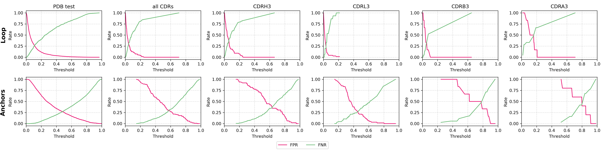

---

<div align="center">    
 
# ITsFlexible: Predicting the conformational flexibility of antibody and TCR CDRs

<a href="https://pytorch.org/get-started/locally/"></a>
<a href="https://pytorchlightning.ai/"></a>
[](https://openreview.net/forum?id=or4tArwd5a)

[](https://doi.org/10.5281/zenodo.15032263)

</div>


ITsFlexible is a Python package for classifying the conformational flexibility of antibody and TCR CDR3s and loop motifs with identical secondary structures (loops bounded between two antiparallel beta-strands) across all proteins. Loops are labelled as flexible if they are predicted to adopt multiple conformations and rigid if they are predicted to adopt a single conformation. A conformations is here defined as an ensemble of structures with a maximum RMSD of 1.25 Å between any two structures.

## Abstract

Many proteins are highly flexible and their ability to adapt their shape can be fundamental to their functional properties. We can now computationally predict a single, static protein structure with high accuracy. However, we are not yet able to reliably predict structural flexibility. A major factor limiting such predictions is the scarcity of suitable training data. Here, we focus on predicting the structural flexibility of the functionally important antibody and T-cell receptor CDR3 loops. We extracted a dataset of CDR3 like loop motifs from the PDB to create ALL-conformations, a dataset containing 1.2 million structures and more than 100,000 unique sequences. Using this dataset, we develop ITsFlexible a method classifying CDR3 flexibility, which outperforms all alternative approaches on our crystal structure datasets and successfully generalises to MD simulations. We also used ITsFlexible to predict the flexibility of three completely novel CDRH3 loops and experimentally determined their conformations using cryo-EM.

## Installation

Create a conda environment:

```bash
conda create -n ITsFlexible_env python=3.10
conda activate ITsFlexible_env
```

Install pytorch 2.3 with the appropriate version for your system, (see [pytorch.org](https://pytorch.org/get-started/locally/)). For cpu only, use:

```bash
pip install torch==2.3.0 --index-url https://download.pytorch.org/whl/cpu
```

Clone the repository and install the package:

```bash
git clone git@github.com:fspoendlin/ITsFlexible.git
cd ITsFlexible
pip install .
```

Install torch geometric for the correct version of your system (see [pytorch-geometric.org](https://pytorch-geometric.readthedocs.io/en/latest/notes/installation.html)). For cpu only, use:

```bash
pip install torch_geometric
pip install pyg_lib torch_scatter torch_sparse torch_cluster torch_spline_conv -f https://data.pyg.org/whl/torch-2.3.0+cpu.html
```

Install conda dependencies:

```bash
conda install -c conda-forge openbabel
```

## Usage

**Inference**

To classify CDRs with ITsFlexible you will need to provide a csv file and have crystal or predicted structures of your antibodies/TCRs in pdb format.

The input csv file with the following columns:

| index | pdb | ab_chains | chain | resi_start | resi_end |
| ----- | --- | --------- | ----- | ---------- | -------- |
| 0     | /path/to/structure.pdb | labels of all chains included in context (i.e. heavy & light chain) | chain with loop | first residue included in loop | last residue included in loop |

The CDRs can be classified using the provided script:

```bash
cd scripts
python predict.py --dataset path/to/dataset.csv --predictor loop
```

or by using the following python code:

```python
from ITsFlexible import classify

classify(infile='path/to/input.csv', outfile='path/to/output.csv', predictor='loop')
```

ITsFlexible provides two predictors for CDR flexiblity: `loop` and `anchors`. These differ in the way in which structural similarity is defined. For `loop` similarity is calculated by alignment on the loop residues themselves, while `anchors` similarity is calculated by alignment on the Fv residues (flanking the loop). For the `loop` predictor we recommend setting `resi_start` to IMGT residue 107 and `resi_end` to 116. For the `anchors` predictor we recommend setting `resi_start` to 105 and `resi_end` to 118. If input structures are not IMGT numbered the suggested numbers should be changed to point to the residues corresponding to the specified IMGT residues.

ITsFlexible outputs a csv file with an additional column containing the predicted classification score. We recommend interpretation of classification scores for the `loop` predictor as follows. These values are chosen based on the false positive rate (FPR) and false negative rate (FNR) observed for classification across test sets for all CDR3s.

| high confidence rigid (FNR <= 0.1)| low confidence rigid (FNR 0.1 - 0.2)| ambiguous | low confidence flexible (FPR 0.1 - 0.2) | high confidence flexible (FPR <= 0.1) |
| ---------------------- | --------------------- | ------------------------ | ------------------------ | ------------------------ |
| 0 - 0.02               | 0.02 - 0.03           | 0.03 - 0.06              | 0.06 - 0.12              | 0.12 - 1                 |


For the `anchors` predictor we recommend the following scores:

| high confidence rigid (FNR <= 0.1)| low confidence rigid (FNR 0.1 - 0.2)| ambiguous | low confidence flexible (FPR 0.1 - 0.2) | high confidence flexible (FPR <= 0.1) |
| ---------------------- | --------------------- | ------------------------ | ------------------------ | ------------------------ |
| 0 - 0.34               | 0.34 - 0.50           | 0.50 - 0.69              | 0.69 - 0.80              | 0.80 - 1                 |


To tune classification scores to each individual class of CDR3s see the figure below:

<p align="center">

</p>


**Training**

A training script to retrain the ITsFlexible models is provided. The training script requires to download the PDB and CDR datasets, this can be done using scripts in `scripts/downloads/`. File paths in the `data/*csv` files may have to be adjusted depending on the where the files are saved. Wandb logging can be set up by specifiying parameters in the `ITsFlexible/trained_models/config*.yaml` files.

```bash
cd scripts
bash downloads/pdb_download.sh
bash downloads/CDR_test_download.sh
python train.py --predictor loop
```

## Citation

```
@article{Spoendlin2025,
	title = {Predicting the Conformational Flexibility of Antibody and T-Cell Receptor CDRs},
	author = {Fabian C. Spoendlin, Monica L. Fernandez-Quintero, Sai S. R. Raghavan, Hannah L. Turner, Anant Gharpure, Johannes R. Loeffler, Wing K. Wong, Guy Georges, Alexander Bujotzek, Andrew B. Ward, and Charlotte M. Deane},
	url = {https://doi.org/10.1101/2025.03.19.644119},
	year = {2025},
}

@article{Spoendlin2024,
	title = {AbFlex: Predicting the conformational flexibility of antibody CDRs},
	author = {Fabian C. Spoendlin, Wing Ki Wong, Guy Georges, Alexander Bujotzek, and Charlotte M. Deane},
	conference = {1st Machine Learning for Life and Material Sciences Workshop at ICML 2024},
	url = {https://openreview.net/forum?id=or4tArwd5a},
	year = {2024},
}
```

The codebase is inspired by  and .
